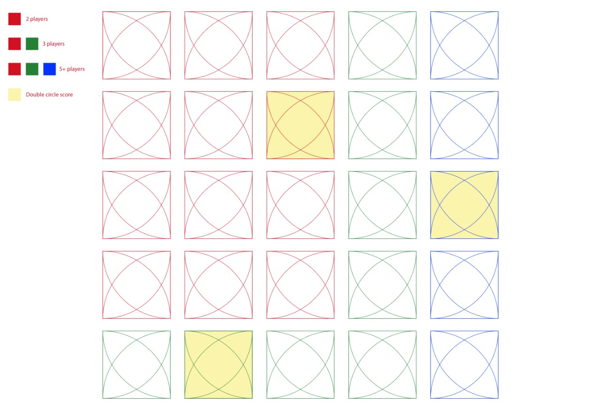
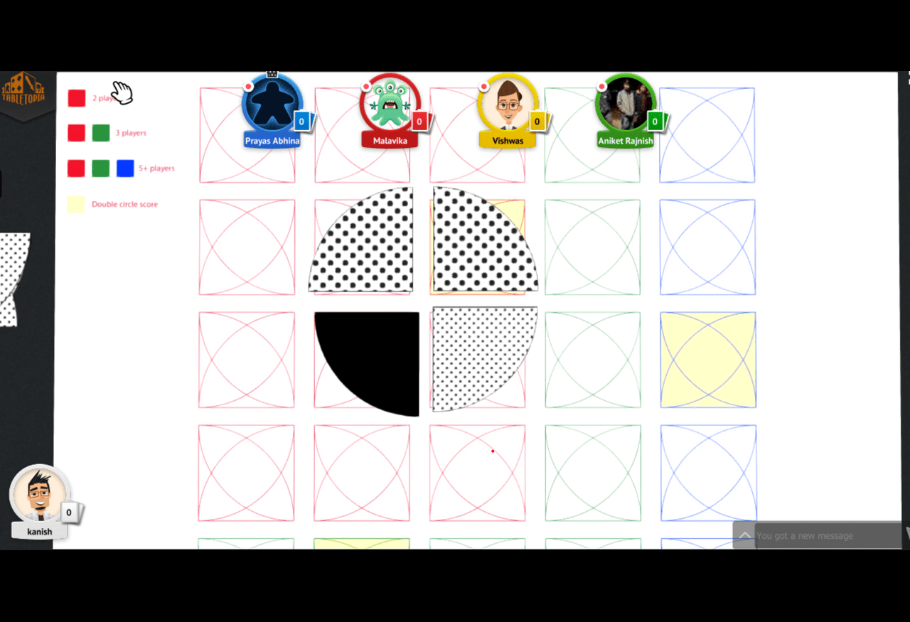

# DES391-1 Modding Assignment

The game has a digital version  hosted here to [play]().
## 1. The original Idea
 * The original game was based around the idea of arranging four quadrants (with different patterns) on the board in such a way that it forms a full circle. If all the four quadrants are made of same pattern, the player gets bonus points. 
 * The player can either turn a quadrant, add a quadrant, remove a quadrant by adding the same pattern.
 * The player who finishes his cards first gets eliminated.
 * Yellow sqaure leads to bonus bonus.   

<table border="0">
 <tr>
    <td></td>
    <td></td>
 </tr>
 <tr>
    <td>The Board</td>
    <td>Winning Condition</td>
 </tr>
</table>

## 2. First iteration (Proposed by Prayas Sir)
 * The first iteration to the change in the rules was proposed by Prayas sir, and he expected us to perform similar modifications to game and then playtest it.
 
 
 ### 3. New Rules (Proposed by us)
 The modded game can be played between a minimum of two players and a maximum of four players.
 Start the game by randomly shuffling the cards deck and then horizontally arranging them.
 The player will alternatively play their chance. They can rotate a card by 90 degrees in a clockwise direction or swap cards with different patterns only if those cards are present in the same horizontal or vertical line. Whoever can play a ¾ th circle with cards of the same pattern earns the point. The player having the maximum points at the end of the game will win.

